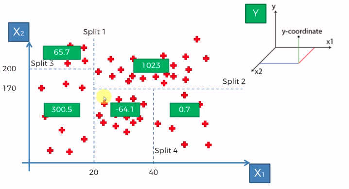
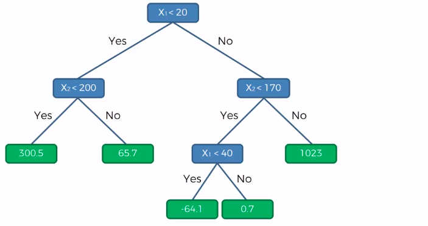

# Decision Regression Tree
* Algorithm automatically separates the information into clusters (leaves)
* Takes the average of values from all leaves and when given new information, predict the value with this averages;
* Utilizes information entropy to determine where are the splits on the dataset going to happen;
* Creates regression tree from the interpretation of the information on the scatterplot;
### Scatterplot Splits

### Decision Regression Tree Visualization

