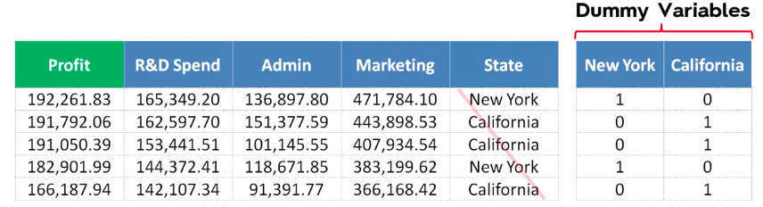
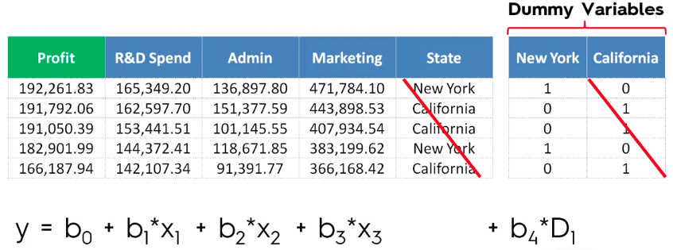

# Multiple Linear Regression
* Linear regression where multiple variables influence the final result of the dependent variable;
* Equantion of the formulae: y = b0 + b1.x1 + b2.x2 + ... + bn.xn
* variable amount of Independent variables;
* Linear Regression models have some assumptions that should be checked for its validity before the models is developed for the given dataset. Those are:
  1. Linearity
  2. Homoscedasticity
  3. Multivariate normality
  4. Independence of errors
  5. Lack of multicollinearity
* Just as we did in the Simple Linear Regression session, when creating regression models where the rolls are represented by text (categorical columns), we have to use _dummy variables_ just as mentioned before;
* Dummy variables are a matrix representation of a column, where for every row on the matrix, only one column will have the number **1** which is representing the text before, the other columns will be **0**;

* **Dummy Variable Trap**: when one variable can be predicted by means of another variable, making it impossible for the algorithm to determine the impact of each variable on the model(Multiple Linearity);
* We will always have to omit **one** dummy variable from our matrix, independently of the amount of variables in the matrix;

* This characteristics comes from the mathematics of solving linear equations, where we eliminate variables by replacing them with a relation to the other variable in the new equation, solving it for the last variable and then working our way back;

## How to build models
* When creating Multiple Linear Regression models, one of the first steps is to decide which variables will be used to train the model and which won't;
* Using too many variables to create a model is not the best approach, since:
  1. **Garbage in = Garbage out**;
  2. You will most likely have to explain why those variables are affecting the final result, and when dealing with lots of variables it can be hard to distinguish which effect each of them will have;
* Five methods for building the models:
  1. All-in;
  2. Back Elimination;
  3. Forward Selection;
  4. Bidirectional Elimination;
  5. Score Comparison;
* Some people calls the combination of Backward Elimination, Forward Selection and Bidirectional Elimination **Stepwise Regression**;
### 1. All-in
* Throw all variables in the models; 
* prior knowledge that they all belong in the model; OR
* You have to put all of the variables there, predetermined behavior; OR
* When preparing for backward elimination **step**

### 2. Backward Elimination
* **STEP 1:** Select a significance level to stay in the model (generally 0.05);
* **STEP 2:** Fit the full model with all the variables;
* **STEP 3:** Consider the variable with the **higher** p-value, if its higher than the significance level go to STEP 4, otherwise your model is finished;
* **STEP 4:** Remove the variable;
* **STEP 5:** Fit the model without the removed variable;

### 3. Forward Selection
* Not simply the opposite of backward elimination;
* **STEP 1:** Select a significance level to enter the model;
* **STEP 2:** Fit all simple linear regression models (one for each variable). Select the one with the **lowest** p-value;
* **STEP 3:** Keep this variable and fit all possible models with one more variable added to the one you have; (grows the models one variable at the time, if it has a p-value lower than the significance)
* **STEP 4:** Consider the model with the **lowest** p-value, if it is lower than the significance level, go back to STEP 3, otherwise your models is done;
### 4. Bidirectional Elimination (Stepwise Regression)
* **STEP 1:** Select two significance levels, one for entrance and another for stay;
* **STEP 2:** Perform the next step of the **Forward Selection** method (starting model with 1 variable with p-level lower than the entrance level);
* **STEP 3:** Perform **all** steps of the **Backward elimination** (old variables have to have a p-value lower than the significance level for stay);
* **STEP 4:** No new variables can enter and no old variables can exit;
### 5. Score comparison
* **STEP 1:** Select a criterion of goodness of fit
* **STEP 2:** Construct all possible regressions models (2^n - 1)
* **STEP 3:** Select the one with the best criterion;
