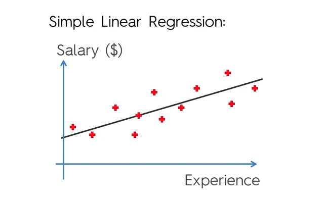

# Simple Linear Regression
* Equation of the formula: y = b0 + b1. x1, where:
  * y = dependent variable (DV);
  * x1 = independent variable (IV);
  * IV Coefficient (proportionality between IV and DV);
  * b0 = Constant.
* This formulae represents a slopped/trend line on xy coordinates that shows the relation between the dependent and independent variables;
* Basically visualizes all the information and fits a line the best represents the dataset as a whole;

* The **Constant** means the point at which the line crosses the axis at x=0, or, it is where the line crosses the y-axis
* Feature Scaling doesn't need to be performed everytime in Simple Linear Regression.

## Ordinary Least Squares
* the process used to fit the model to the dataset;
* Finds the difference from model expected value to observed value and takes it square for every observation on the dataset. The best fitting model will be the one that has the minimun sum of the difference squares, which means the models tries to deviate the least as possible from the observations;
